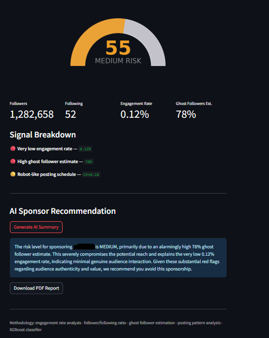

# Instagram Fake Follower Detector

A data tool that scores Instagram profiles for fake and purchased followers, giving sponsors a clear signal before committing budget to an influencer deal.

**Built by [Tobi Kazeem](https://www.linkedin.com/in/tobi-a-k-01/)** · Senior Data Analyst · Hamburg, Germany

---

## The problem

Influencer marketing fraud costs brands an estimated $1.3 billion annually. A brand with a modest budget has no affordable, reliable way to verify whether an influencer's audience is genuinely engaged or padded with purchased followers. Commercial tools like HypeAuditor exist but are priced for enterprise. This tool makes the core analysis accessible to anyone.

---

## What it does

Input any public Instagram username. The tool scrapes profile and post data via Apify, engineers 5 analytical features, scores the profile using a rule-based engine (with an XGBoost classifier once training data is labeled), and returns:

- A **Fake Score from 0–100** with risk level (low / medium / high)
- A **signal breakdown** explaining which patterns drove the score
- An optional **AI-generated sponsor recommendation** via Claude API
- A downloadable **PDF report** for sharing with stakeholders



---

## How the scoring works

The model uses 5 signals derived from profile and post data:

### 1. Engagement rate
Likes and comments divided by follower count. Real accounts get 1–15% depending on size. Below 0.5% on a small account is a strong red flag. Importantly, this tool applies **tiered baselines by account size** — a 274M follower account like NatGeo is expected to have ~0.1% engagement, not 3%, because engagement rate naturally decays at scale. A flat baseline would wrongly flag every large legitimate account.

### 2. Follower / following ratio
Real influencers accumulate followers without needing to follow back. A ratio close to 1:1 (following nearly as many as follow you) is a classic signal of follow/unfollow bot activity — automated accounts that follow people hoping for a follow-back, then unfollow them.

### 3. Ghost follower estimate
This is a calculated heuristic, not a direct measurement. Direct measurement would require scraping every individual follower — expensive and rate-limited. Instead the tool asks: given this follower count, how many followers *should* be engaging based on size-adjusted industry averages? The gap between expected and actual engagement approximates the ghost follower percentage. This is explicitly documented as an estimate with known error margins.

### 4. Posting consistency (coefficient of variation)
Measures the standard deviation of gaps between posts, divided by the mean gap. A very low CV (near zero) means posts are spaced almost mechanically — often a sign of bot-scheduled content. A high CV reflects human irregularity. This is a weak signal used in combination with others, not standalone — many legitimate creators use scheduling tools.

### 5. Bio completeness
A simple 0–1 score for whether the profile has a name, biography, and external link. Bot farms create accounts in bulk and rarely invest in full profiles. Again, a weak signal used as a tiebreaker.

---

## Known limitations

These are documented intentionally. Understanding where a model breaks is as important as building it.

**Ghost follower estimate is a heuristic.** Real ghost follower detection requires follower-level scraping to inspect each account individually. The current approach estimates from the engagement gap — it can be fooled by accounts in low-engagement niches where even real followers don't interact much.

**Engagement rate decay varies by niche, not just size.** A meme account and a B2B thought leader with identical follower counts will have very different natural engagement rates. The tiered baseline improves on a flat 3% but is still an approximation. A production version would use niche-specific benchmarks.

**Private accounts are a blind spot.** For private profiles the tool loses all post engagement data and falls back on profile-level signals only — follower/following ratio, bio completeness, and verification status. Confidence is explicitly flagged as lower for these cases. This is particularly relevant in markets like Germany where private accounts are culturally more common among real creators.

**The classifier needs labeled training data.** The current scoring uses a rule-based engine. The XGBoost model is scaffolded and ready to train — it needs ~200 manually labeled profiles (real vs fake) to become the primary scorer. See `data/labeled/README.md` for the labeling guide.

---

## Tech stack

| Layer | Tools |
|---|---|
| Data collection | Python, Apify (`apify/instagram-profile-scraper` + `instagram-scraper/fast-instagram-post-scraper`) |
| Feature engineering | Pandas, NumPy |
| ML model | XGBoost, scikit-learn |
| Database | PostgreSQL |
| App | Streamlit |
| AI narrative | Anthropic Claude API (optional) |
| PDF export | ReportLab |
| Infrastructure | Docker, Docker Compose |

---

## Architecture

Two Apify actors are called in sequence and joined on `username`:

```
Actor 1: instagram-profile-scraper  →  followers, following, bio, verified
Actor 2: fast-instagram-post-scraper →  likes, comments, timestamps per post

Join on username
    ↓
Feature engineering (5 signals)
    ↓
Rule-based scorer (XGBoost when model trained)
    ↓
Signal interpretation + risk level
    ↓
Optional: Claude API generates sponsor recommendation
    ↓
Streamlit UI + PDF export
```

This two-actor architecture is more resilient than a single scraper — if one actor is rate-limited or updated, the other continues functioning independently.

---

## Project structure

```
instagram-fake-detector/
├── app/
│   ├── main.py               # Streamlit app entry point
│   └── components.py         # Score gauge, signal cards, metrics
├── src/
│   ├── scraper/
│   │   ├── apify_scraper.py  # Two-actor Apify integration
│   │   └── profile_parser.py # Raw API response → clean dicts
│   ├── features/
│   │   ├── engagement_features.py  # Core signal formulas
│   │   └── feature_pipeline.py     # Builds feature vector
│   ├── model/
│   │   ├── train.py          # XGBoost training script
│   │   ├── predict.py        # Inference + signal interpretation
│   │   └── evaluate.py       # ROC curve, confusion matrix
│   └── api/
│       ├── claude_analyzer.py  # LLM sponsor summary
│       └── pdf_report.py       # ReportLab PDF export
├── db/
│   ├── schema.sql            # PostgreSQL schema
│   └── seeds/                # Bootstrap training data
├── data/
│   ├── fixtures/             # Real API responses for local testing
│   ├── labeled/              # Training data (gitignored)
│   └── processed/            # Trained model artifact (gitignored)
├── tests/                    # pytest suite
├── docker-compose.yml        # Postgres + Streamlit stack
├── docker/Dockerfile
└── .env.example
```

---

## Getting started

### Prerequisites
- Docker Desktop
- Apify account (free tier — ~5 free runs/month)
- Anthropic API key (optional — only needed for AI summaries)

### Setup

```bash
git clone https://github.com/adheir01/instagram-fake-detector.git
cd instagram-fake-detector
cp .env.example .env
# Add your APIFY_API_TOKEN to .env
# Add ANTHROPIC_API_KEY to .env if you want AI summaries
```

### Run

```bash
docker-compose up --build
# App runs at http://localhost:8501
```

### Test without API credits

Click **Try Demo Data** in the app — this loads from `data/fixtures/` and runs the full pipeline locally with no API calls. Good for development and demos.

### Train the classifier

Once you have labeled profiles in `data/labeled/labeled_profiles.csv`:

```bash
docker-compose exec app python -m src.model.train
# Prints CV AUC score and feature importances
```

See `data/labeled/README.md` for labeling criteria and CSV format.

---

## Prior work and research context

This is a well-studied problem in academic literature. Notable prior work includes:

- **SybilRank** (Cao et al., 2012) — graph-based Sybil detection using network structure rather than profile signals. The insight that fake accounts cluster together because they're created by the same bot farms is still the strongest signal available if follower-level data can be scraped.
- **"The Rise of Social Bots"** (Ferrara et al., 2016) — comprehensive survey of bot detection on social platforms, freely available.
- **HypeAuditor** — the commercial state-of-the-art. Uses follower-level scraping at scale for direct ghost detection. This tool takes a different approach — profile and post level analysis only — making it feasible on a free scraping tier.

The academic term for what this tool does is **inauthentic behaviour detection** or **social spam detection**.

---

## Roadmap

- [ ] Follower-level scraping for direct ghost detection (requires paid Apify tier)
- [ ] Niche-specific engagement benchmarks — not just size tiers
- [ ] Private account confidence scoring — partial analysis with explicit uncertainty
- [ ] dbt models for the metrics layer (in progress — Project 02)
- [ ] Multi-account comparison for sponsor ROI scoring (Project 02)
- [ ] Anomaly detection on engagement time series (Project 03)

---

## LinkedIn post when you ship this

> "Brands lose over a billion dollars a year sponsoring influencers with fake audiences.
> I built a tool that scores any public Instagram profile for fake followers — engagement analysis, ghost follower estimation, posting pattern detection.
> Stack: Python · XGBoost · PostgreSQL · Streamlit · Docker · Apify · Claude API
> What I found interesting: engagement rate thresholds can't be flat — a 274M follower account and a 5K follower account have completely different natural engagement rates. The model has to know the difference.
> Repo + demo in comments."
